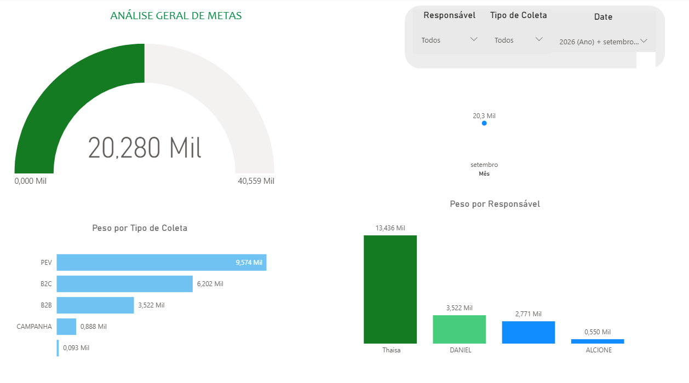
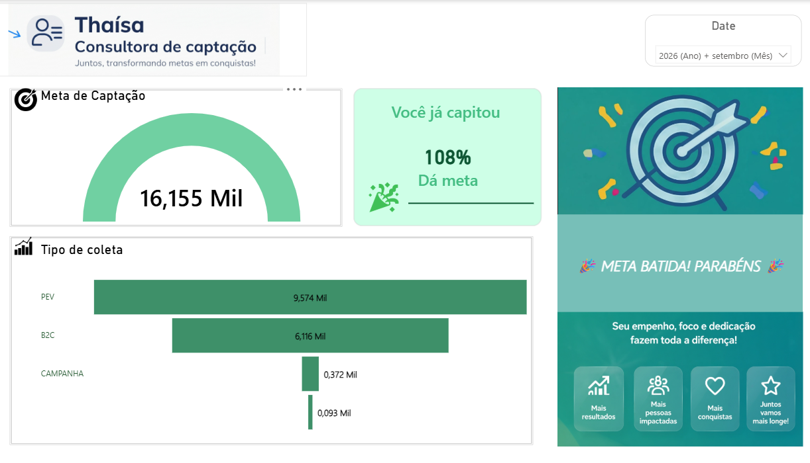
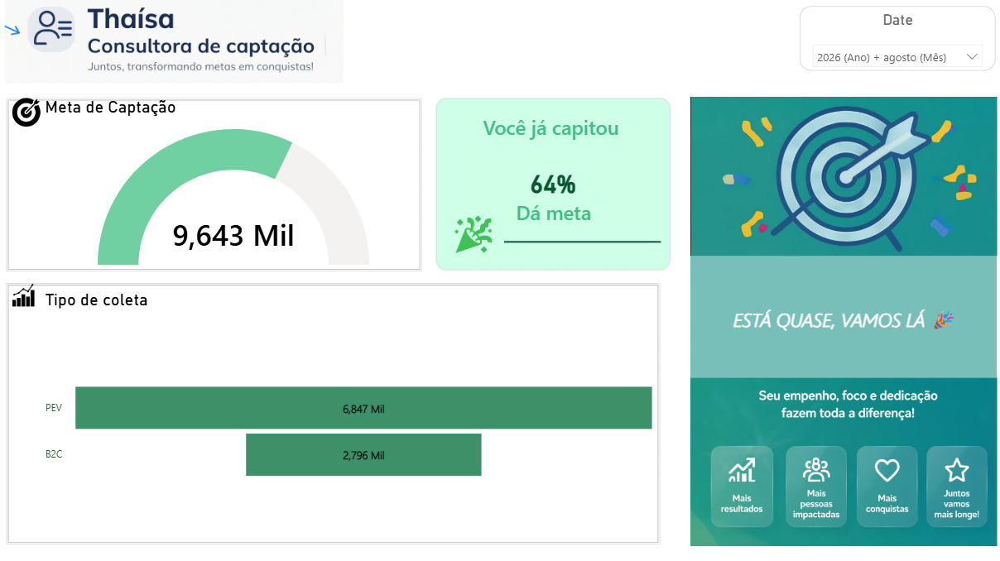

# Dashboard de Metas Comerciais

Painel de acompanhamento de metas de captação e desempenho comercial, desenvolvido para apoiar uma gestão mais clara e orientada por dados.

## Objetivo

Reunir, em uma visão consolidada, o andamento das metas do time comercial e permitir a análise dos resultados por responsável. A proposta é facilitar o acompanhamento da evolução, apoiar conversas de gestão e reconhecer os resultados alcançados.

## Dados e acompanhamento

Segundo a descrição do projeto, os dados são consolidados a partir de fontes organizadas em planilhas (Sheets/Excel). O dashboard apresenta, entre outras visões:

- progresso da meta de captação no período selecionado;
- atingimento percentual em relação à meta;
- resultados por tipo de coleta, como PEV e B2C;
- comparação dos resultados por responsável;
- filtros de período para acompanhar diferentes meses.

## Capturas do dashboard

### Visão geral das metas

### Acompanhamento individual — setembro

### Acompanhamento individual — agosto

## Observação sobre o conteúdo

Este repositório documenta o dashboard por meio das capturas fornecidas. O arquivo do relatório (por exemplo, `.pbix`), scripts de transformação, planilhas de origem e detalhes técnicos da conexão não foram enviados, portanto não estão incluídos nem foram presumidos.

As capturas mantêm os nomes, percentuais e valores que aparecem nos originais. O repositório foi criado como **privado** por padrão, pois as imagens exibem resultados comerciais por pessoa. Antes de mudar a visibilidade ou compartilhar as imagens fora da equipe, confirme que os dados e identificações podem ser divulgados.
